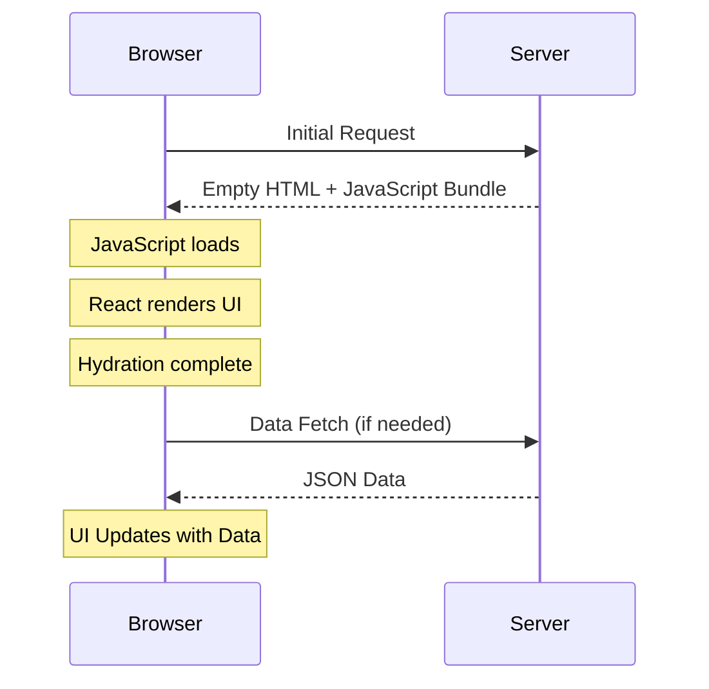
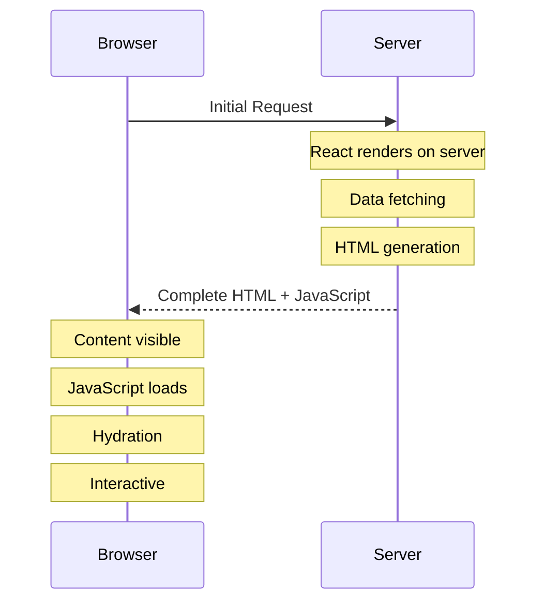
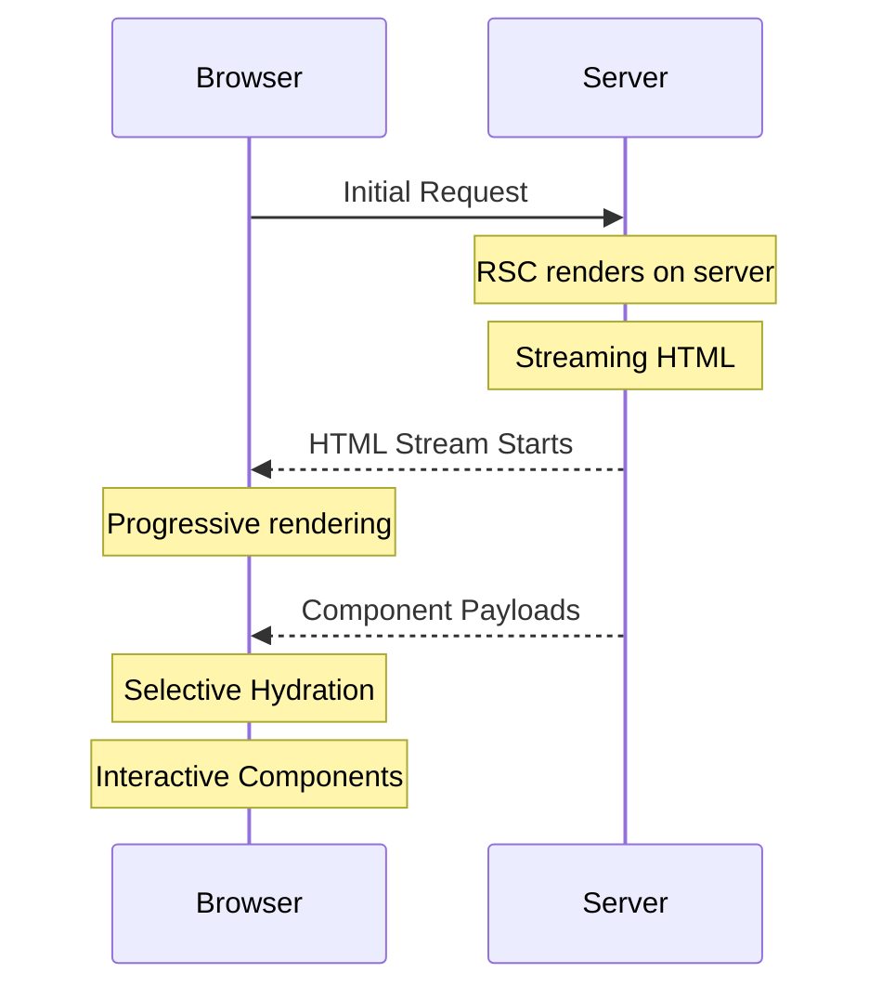

# Next.js Rendering Patterns Explained

## 1. Client-Side Rendering (CSR)



### CSR の特徴
- 初期ロードが遅い（JavaScript バンドルのダウンロードと実行が必要）
- SEO に不利（初期 HTML が空）
- インタラクティブな UI に適している
- サーバーの負荷が低い

## 2. Server-Side Rendering (SSR)



### SSR の特徴
- 初期表示が速い（完全な HTML を受け取る）
- SEO に有利
- Time to First Byte (TTFB) が遅くなる可能性
- サーバーの負荷が高い

## 3. React Server Components (RSC) with App Router



### RSC の特徴と従来の SSR との違い

#### 1. コンポーネントレベルの最適化
- **従来の SSR**
  - ページ単位でレンダリング
  - すべてのコンポーネントが JavaScript を含む

- **RSC**
  - コンポーネント単位でサーバー/クライアントを選択可能
  - クライアントバンドルサイズの削減
  - `use client` ディレクティブによる明示的な制御

#### 2. データフェッチング
- **従来の SSR**
  - ページレベルの `getServerSideProps`
  - ウォーターフォール的なデータフェッチ

- **RSC**
  - コンポーネントレベルでの非同期データフェッチ
  - 並列データフェッチの最適化
  - サーバーサイドのみで実行される効率的なデータアクセス

#### 3. ストリーミング
- **従来の SSR**
  - ページ全体のレンダリング完了を待つ必要がある
  - TTFB が遅くなりやすい

- **RSC**
  - コンポーネント単位でのストリーミング
  - 重要なコンテンツの優先的な表示
  - Suspense による細かい制御

## 4. 実装例

### Client Component
```tsx
'use client'

import { useState } from 'react'

export default function Counter() {
  const [count, setCount] = useState(0)
  return (
    <button onClick={() => setCount(count + 1)}>
      Count: {count}
    </button>
  )
}
```

### Server Component
```tsx
async function ProductList() {
  const products = await fetchProducts() // サーバーサイドのみで実行

  return (
    <ul>
      {products.map(product => (
        <li key={product.id}>{product.name}</li>
      ))}
    </ul>
  )
}
```

### Streaming with Suspense
```tsx
import { Suspense } from 'react'

export default function Page() {
  return (
    <div>
      <h1>My Shop</h1>
      <Suspense fallback={<LoadingSkeleton />}>
        <ProductList />
      </Suspense>
    </div>
  )
}
```

## 5. 選択指針

- **CSR を選ぶ場合**
  - 高度にインタラクティブな UI
  - SEO が重要でない
  - データが頻繁に更新される

- **従来の SSR を選ぶ場合**
  - SEO が重要
  - 初期表示速度が重要
  - データの更新頻度が低い

- **RSC を選ぶ場合**
  - パフォーマンスの最適化が重要
  - きめ細かいローディング制御が必要
  - バンドルサイズの削減が必要
  - マイクロフロントエンド的なアプローチ